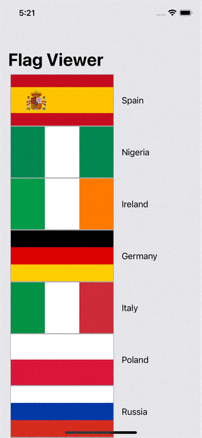

# Flag Viewer

A simple app that uses the table view controller to view a list of country flags, view each image individually and save the flag image to your phone or share via social media.
From [Challenge Milestone: Projects 1-3](https://www.hackingwithswift.com/100/23). A project to review what I've learned so far.

## What I learned:

- How to place a image and a label on each individual cell
- Use UIActivityViewController to share images
- Review things like UITableView, UIImageView, UIBarButtonItem, UIViewController, UITableViewController, NavigationController

## Demo

