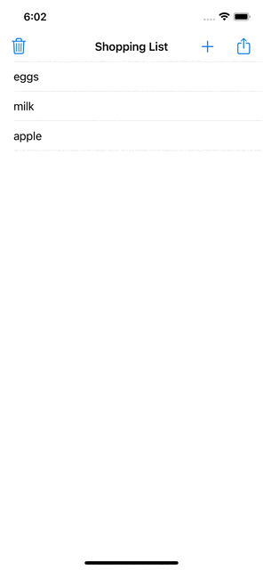
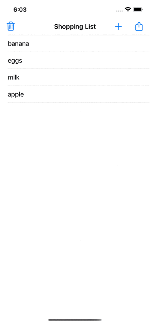

# Shopping List

This app displays a shopping list where you can add new items, delete and copy your list to share with other people.
From [Challenge Milestone: Projects 4-6](https://www.hackingwithswift.com/guide/ios-classic/3/3/challenge).

## What I learned:
- How to put new data at the top of the list without having to update the entire table view
- Use UIAlertController to get user input
- How to use the navigation bar to place more than one button item
- Review things used in previous projects

## Demo

